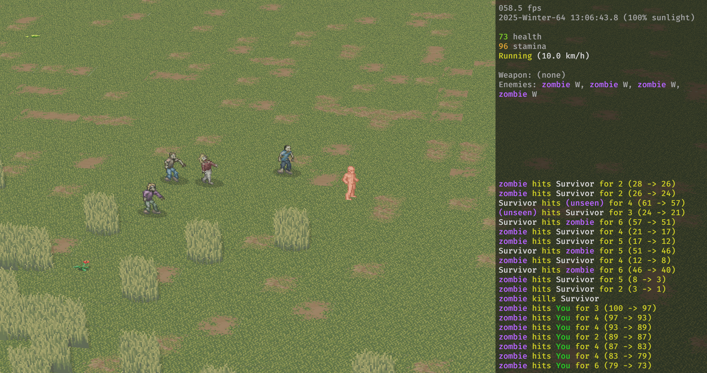
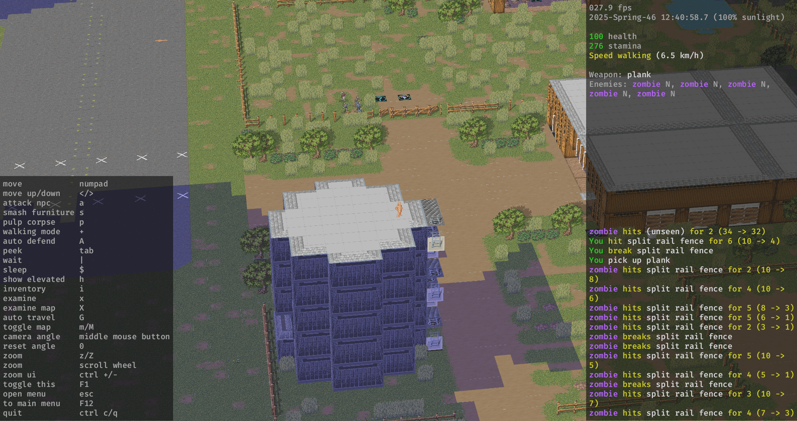

# Rustaclysm

A 3D reimplementation of [Cataclysm: Dark Days Ahead](https://cataclysmdda.org/) using [Rust](https://www.rust-lang.org/) and [Bevy](https://bevyengine.org/)

## Goals

1. Data-compatibility with Cataclysm: DDA
2. User-friendly UI

## Supported features

Currently, these features are (partially) supported:

- Loading existing saves from Cataclysm: Dark Days Ahead
- Walking around
- Inventory
- Crafting
- Health and stamina
- Killing and being killed by zombies
- Opening and closing doors and windows
- Examining items and tiles
- Sleeping
- Day-night cycle

## Getting started

1. Download and install the [experimental version](https://cataclysmdda.org/experimental/) of Cataclysm: Dark Days Ahead.
2. Create a world in it and save a character in that world. An existing world and character will work as well. We will load this save later.
3. Download the [latest release](https://github.com/papow65/rustaclysm/releases) of Rustaclysm.
4. Run rustaclysm
5. Follow the instructions to set up the necessary symlinks or directories.

## Development

1. Install the [experimental version](https://cataclysmdda.org/experimental/) of Cataclysm: Dark Days Ahead.
2. Create a world in it and save a character in that world. An existing world and character will work as well. We will load this save later.
3. Install [git](https://git-scm.com/book/en/v2/Getting-Started-Installing-Git), [Rust, and Cargo](https://forge.rust-lang.org/infra/other-installation-methods.html#which-installer-should-you-use)
5. Clone the Rustaclism git repository. When using the command line: `git clone https://github.com/papow65/rustaclysm.git`
6. Navigate to the Rustaclism directory. When using the command line: `cd rustaclysm`
7. Launch it by running the command `cargo run` on the command line.
8. Follow the instructions to set up the necessary symlinks or directories in the `assets` directory.

## License

See [license.md](license.md)

## Screenshots

